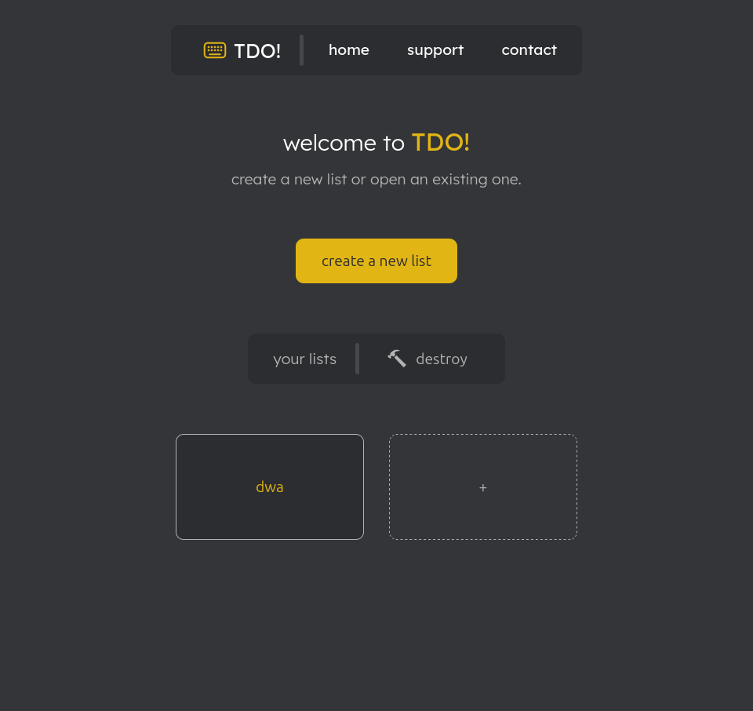

    

<h1 align="center">TDO! (CLI To-do app)</h1>

    A CLI based To-do app made for nerds. Write fast, plan faster.
     
    <a style="font-size:20px; color: #e2b714" href="https://tdo-app.vercel.app/">Live demo - hosted on Vercel</a>

    
    
    

<h2 style="color:#e2b714">Description</h2>

A to-do app meant to look and feel minimalistic, with the developer experience in mind. Use your keyboard just as you would in a terminal or command-line based program to control the app.
 

<h2 style="color: #e2b714">Features</h2>
<ul style="font-size: 16px">
    <li>Minimalist and elegant design inspired by <a style="color: #e2b714" href="https://monkeytype.com/">MonkeyType</a></li>
    <li>Create,delete and edit lists</li>
    <li>Manage tasks</li>
    <li>Drag & drop sorting</li>
    <li>Command line to control the interface (IN PROGRESS)</li>
</ul>

<h2 style="color: #e2b714">Motivations</h2>
I love my keyboard, I use it <b>a lot</b>. But when I'm working, I often have to take one hand off my keyboard to control my mouse because other apps are not accessible to keyboard users, which really annoys me.
  
This is really the motive behind this project. <b style="color: #e2b714">TDO!</b> is about making productivity tools accessible for nerds and people who really like to type.

<h3>Dev related things</h3>
The project encapsulates my skills obtained throughout my Front-end learning journey. I wanted to use only browser-standard features, since I focused only on the vanilla-side of things.
  
This was also my first time using Web-components and I have enjoyed working with them. Inspired or not, the first thought that came across my mind when approaching this project, was to reuse and separate the task behaviour from the project, to make it alive on its own, as I was thinking this was more appropriate and posed an interesting challenge.
  
Also, the HTML Drag&Drop API is really good and made my life much easier, as I didn't have to implement it from scratch + <a href="https://www.jsdelivr.com/package/npm/drag-drop-touch">I found a great polyfill for mobile support</a>.

<h2 style="color: #e2b714">Author</h2>
<b style="font-size: 20px">Cristian Năstase</b>
 
<ul style="font-size:16px">
    <li><a style="color: #e2b714" href="https://github.com/Cristian-Nastase">Github</a></li>
    <li><a style="color: #e2b714" href="https://www.linkedin.com/in/cristian-florin-nastase-383a1b397/">Linkedin</a></li>
</ul>
